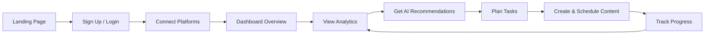
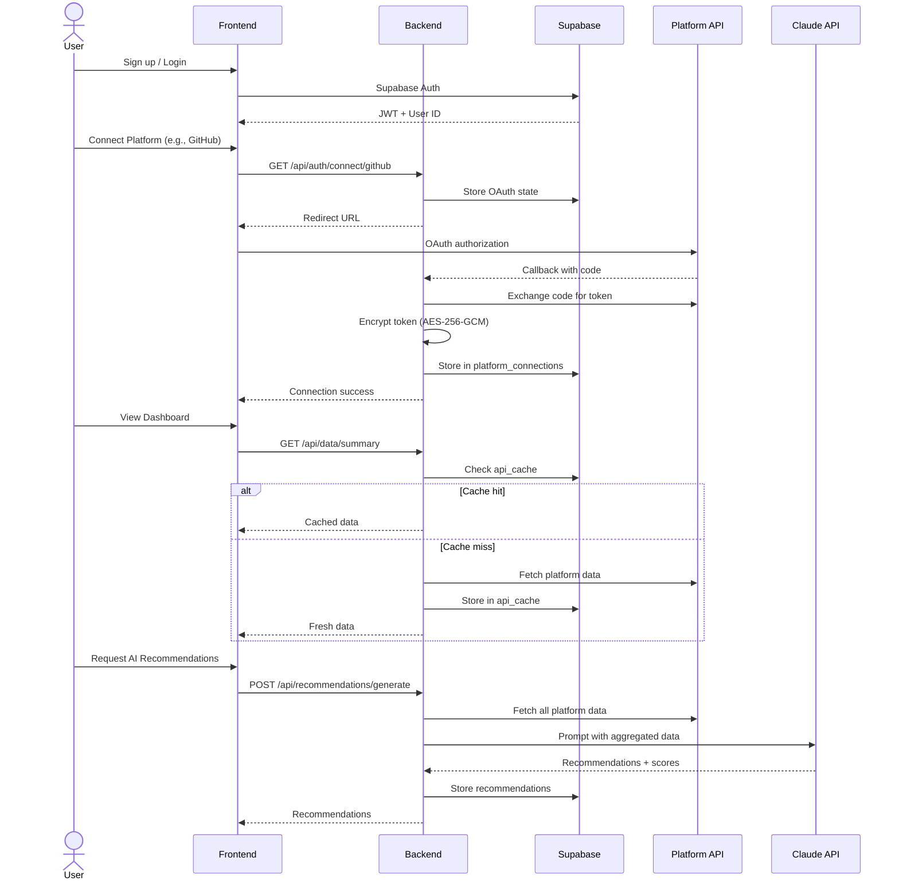

# Synalytix — Product Requirements Document

| Field | Value |
|---|---|
| **Version** | 1.0 |
| **Date** | 2026-07-27 |
| **Status** | Draft |
| **Owner** | Synalytix Engineering |

---

## Table of Contents

1. [Executive Summary](#1-executive-summary)
2. [Product Overview](#2-product-overview)
3. [Features](#3-features)
4. [Functional Requirements](#4-functional-requirements)
5. [Non-Functional Requirements](#5-non-functional-requirements)
6. [User Stories](#6-user-stories)
7. [Screens](#7-screens)
8. [Business Rules](#8-business-rules)
9. [Risks](#9-risks)
10. [Assumptions](#10-assumptions)
11. [Future Enhancements](#11-future-enhancements)
12. [Documentation Completeness Report](#12-documentation-completeness-report)

---

## 1. Executive Summary

### 1.1 Product Overview

Synalytix is a unified digital identity analytics platform that aggregates data from GitHub, Instagram, X/Twitter, LinkedIn, and LeetCode, applies AI-powered analysis via Anthropic Claude, and delivers career-oriented recommendations. It provides a single pane of glass for professionals to monitor, optimize, and plan their digital presence.

### 1.2 Problem Statement

Professionals maintain presence across 5+ platforms. Each platform provides siloed analytics, if any. There is no unified view of a person's digital professional identity, and no tool that synthesizes cross-platform data into actionable career guidance. The result: fragmented signal, missed opportunities, and wasted effort on low-impact activities.

### 1.3 Vision

Become the definitive platform where professionals quantify, optimize, and grow their digital professional identity through data-driven insight and AI-powered guidance.

### 1.4 Objectives

1. Aggregate data from major professional and social platforms into a unified dashboard.
2. Apply AI scoring to quantify professional standing across career, employability, branding, and technical dimensions.
3. Deliver personalized, prioritized recommendations for career growth.
4. Enable content creation and scheduling across connected platforms.
5. Provide a calendar-based planner for tracking professional development tasks.

### 1.5 Success Criteria

| Metric | Target |
|---|---|
| Time to first insight (new user) | < 5 minutes after connecting first platform |
| Recommendation relevance (user feedback) | ≥ 80% rated useful |
| Cross-platform data freshness | ≤ 1 hour staleness |
| Platform connection success rate | ≥ 95% OAuth flows complete |
| User retention (weekly active) | ≥ 40% at 30 days |

---

## 2. Product Overview

### 2.1 Purpose

Synalytix centralizes professional platform data, scores digital presence, and generates AI-driven career recommendations — eliminating manual cross-platform analysis.

### 2.2 Target Users

- Software engineers and developers tracking GitHub/LeetCode presence
- Marketing professionals monitoring social media metrics
- Job seekers optimizing LinkedIn and X profiles
- Career changers needing gap analysis and learning roadmaps
- Freelancers and consultants managing multi-platform visibility

### 2.3 User Personas

| Persona | Description | Primary Platforms | Key Need |
|---|---|---|---|
| **DevDynasty** | Mid-level software engineer, active on GitHub/LeetCode, wants FAANG job | GitHub, LeetCode, LinkedIn | Technical score, interview prep roadmap |
| **SocialStar** | Marketing lead, wants to grow thought leadership on X and LinkedIn | X, LinkedIn, Instagram | Audience growth strategy, content optimization |
| **CareerChanger** | Backend dev pivoting to ML, needs gap analysis and skill plan | GitHub, LeetCode, LinkedIn | Learning roadmap, opportunity alerts |
| **FreelancePro** | Independent consultant, manages client presence across all platforms | All 5 | Cross-platform health, content scheduling |

### 2.4 User Journey

### 2.5 User Flow

---

## 3. Features

### 3.1 Authentication

| Field | Detail |
|---|---|
| **Description** | User registration and login via Supabase Auth with email/password and GitHub OAuth. Backend verifies JWT on all protected routes. |
| **Business Value** | Secure access foundation; enables per-user data isolation via RLS. |
| **User Goals** | Create account, log in, maintain session across page refreshes. |
| **Functional Behaviour** | Email/password signup and login. GitHub OAuth via Supabase. JWT sent in Authorization header. Backend middleware validates JWT and attaches `userId` to request. |
| **Inputs** | Email, password, or GitHub OAuth token. |
| **Outputs** | JWT, user session, user profile record. |
| **Dependencies** | Supabase Auth, Supabase `user_profiles` table. |
| **Edge Cases** | Duplicate email registration. Expired JWT. GitHub OAuth scope denial. Session expiry during long operation. |
| **Limitations** | **[PARTIAL]** Frontend auth is mocked — always auto-authenticates in dev mode. No email verification flow implemented. No password reset flow implemented. |

### 3.2 Platform Connections (OAuth)

| Field | Detail |
|---|---|
| **Description** | OAuth 2.0 integration with GitHub, Instagram (Meta Graph API), X (PKCE), LinkedIn. LeetCode uses username-based connection (no OAuth). |
| **Business Value** | Core data pipeline — without connections, the platform has no data. |
| **User Goals** | Connect one or more platforms to begin receiving analytics and recommendations. |
| **Functional Behaviour** | Frontend initiates connection via `GET /api/auth/connect/:platform`. Backend generates CSRF state, stores in `oauth_states` (10 min TTL), returns redirect URL. User authorizes on platform. Platform redirects to callback. Backend exchanges code for token, encrypts with AES-256-GCM, stores in `platform_connections`. Instagram: exchanges short-lived token for long-lived token. X: uses PKCE flow. |
| **Inputs** | Platform OAuth authorization. |
| **Outputs** | Encrypted token stored, `platform_connections` record, connection status. |
| **Dependencies** | Platform OAuth APIs, Supabase DB, `ENCRYPTION_SECRET`. |
| **Edge Cases** | OAuth state expired (10 min). Token refresh failure. Platform API rate limits during token exchange. Instagram token exchange returning error. User denies scope. Reconnecting an already-connected platform. |
| **Limitations** | LeetCode has no OAuth — uses username lookup only. LinkedIn post analytics limited by API scope. X impression data requires Basic tier ($100/mo). |

### 3.3 Dashboard

| Field | Detail |
|---|---|
| **Description** | Unified overview of all connected platforms with KPI cards, views chart, audience split, studio/planner status, network health, and AI insight banner. |
| **Business Value** | First screen users see — establishes value proposition instantly. |
| **User Goals** | At-a-glance health check of all platforms. Quick access to key metrics. |
| **Functional Behaviour** | Fetches aggregated data from `/api/data/summary`. Displays KPI cards (followers, engagement, etc.), Recharts-based line/area views chart, audience split breakdown, studio and planner status widgets, network health indicator for each platform, AI insight banner with top recommendation. |
| **Inputs** | Aggregated platform data from backend. |
| **Outputs** | Visual dashboard with charts and cards. |
| **Dependencies** | All platform data endpoints, Recharts, Framer Motion. |
| **Edge Cases** | No platforms connected (empty state). Partial connections (some platforms missing). API timeout on any platform. All platforms showing zero metrics. |
| **Limitations** | **[PARTIAL]** Frontend API calls return mock data — not wired to real backend. |

### 3.4 Studio (Content Studio)

| Field | Detail |
|---|---|
| **Description** | AI content drafting engine for creating, optimizing, and scheduling posts across connected platforms. |
| **Business Value** | Monetization surface — premium AI-powered content creation. |
| **User Goals** | Draft a post, optimize it for each platform's audience, schedule publication. |
| **Functional Behaviour** | Multi-step content creation wizard. AI drafts content based on prompt. Platform-specific optimization (character limits, hashtag suggestions, tone). Draft management (save, edit, delete). Schedule posts for future publication. |
| **Inputs** | User prompt/topic, platform selection, scheduling preferences. |
| **Outputs** | Optimized content drafts, scheduled post entries. |
| **Dependencies** | AI API, platform posting APIs (future), scheduler. |
| **Edge Cases** | Content exceeds platform limits. Scheduling conflict. AI generates inappropriate content. Platform connection lost after scheduling. |
| **Limitations** | **[PARTIAL]** Content posting to platforms not implemented. Scheduling UI exists but backend execution not wired. |

### 3.5 Platform Analytics (App Details)

| Field | Detail |
|---|---|
| **Description** | Per-platform deep-dive analytics — GitHub repos/contributions, Instagram insights/audience/content, X tweets, LinkedIn posts, LeetCode stats/submissions. |
| **Business Value** | Depth of data drives engagement; users return to monitor trends. |
| **User Goals** | Understand platform-specific performance, identify trends, compare periods. |
| **Functional Behaviour** | Platform-specific data fetching from backend endpoints. GitHub: profile, repos, contributions, languages. Instagram: profile, insights, media. X: profile, tweets. LinkedIn: profile, posts. LeetCode: stats, submissions. Each with charts and time-series views. |
| **Inputs** | Platform identifier, account ID (optional). |
| **Outputs** | Platform-specific analytics visualizations. |
| **Dependencies** | Backend platform data endpoints, platform APIs. |
| **Edge Cases** | Platform not connected. Rate-limited by platform API. Platform API changes response format. Data missing for requested time period. |
| **Limitations** | LinkedIn post analytics limited by API scope. X impression data requires paid tier. Instagram insights limited to business/creator accounts. |

### 3.6 Analytics Hub

| Field | Detail |
|---|---|
| **Description** | Cross-platform intelligence view with AI recommendations banner and per-platform analytics cards. |
| **Business Value** | Unique value prop — cross-platform synthesis no single platform provides. |
| **User Goals** | Compare performance across platforms, discover cross-platform patterns. |
| **Functional Behaviour** | Aggregates metrics across all connected platforms. AI-generated insights banner. Per-platform analytics cards with key metrics. Drill-down to platform-specific analytics. |
| **Inputs** | Aggregated cross-platform data. |
| **Outputs** | Cross-platform comparison view, AI insights. |
| **Dependencies** | All platform data endpoints, AI API. |
| **Edge Cases** | Single platform connected (no comparison possible). Conflicting metrics across platforms. |
| **Limitations** | Cross-platform metrics may not be directly comparable (different definitions of "engagement"). |

### 3.7 AI Recommendations

| Field | Detail |
|---|---|
| **Description** | AI-generated career recommendations with scores, filters, weekly plan, monthly roadmap, gap analysis, opportunity alerts, and progress tracking. |
| **Business Value** | Core differentiator — transforms raw data into actionable career strategy. |
| **User Goals** | Receive prioritized, personalized career guidance. Track progress on recommendations. |
| **Functional Behaviour** | `POST /api/recommendations/generate` triggers Claude analysis of all platform data. Returns: composite scores (career, employability, branding, technical), prioritized recommendations with category/impact/difficulty, weekly learning plan, monthly roadmap, gap analysis, opportunity alerts. Users can filter, complete, dismiss recommendations. |
| **Inputs** | All connected platform data. |
| **Outputs** | Recommendation objects, scores, alerts, plans. |
| **Dependencies** | Anthropic Claude API, all platform data, `Recommendation`, `CareerScore`, `OpportunityAlert` tables. |
| **Edge Cases** | Claude API timeout. No platforms connected (cannot generate). Generation in progress (duplicate request). All recommendations dismissed. |
| **Limitations** | Depends on Claude API availability and cost. Recommendation quality proportional to data quality from connected platforms. |

### 3.8 Planner

| Field | Detail |
|---|---|
| **Description** | Calendar-based task management with todo lists (unplanned, planned, done) and scheduling. |
| **Business Value** | Converts recommendations into tracked execution; drives daily engagement. |
| **User Goals** | Organize tasks from recommendations, schedule them on calendar, track completion. |
| **Functional Behaviour** | Calendar view with drag-and-drop scheduling. Three-column todo: unplanned → planned → done. Task creation from recommendations or manual. Date assignment and rescheduling. |
| **Inputs** | Tasks (from recommendations or user-created), dates. |
| **Outputs** | Scheduled tasks, completion status. |
| **Dependencies** | Recommendation data, local state (Zustand). |
| **Edge Cases** | No tasks in any column. Overlapping scheduled tasks. Past-date scheduling. |
| **Limitations** | No backend persistence for planner state (frontend-only). Tasks lost on logout/clear data. |

### 3.9 Settings

| Field | Detail |
|---|---|
| **Description** | Account management, preferences, integrations management, billing display. |
| **Business Value** | User retention — account control, connection management, future billing. |
| **User Goals** | Manage account details, toggle connections, set preferences. |
| **Functional Behaviour** | Account info display and edit. Platform connection status and disconnect. Preference toggles (notifications, theme). Billing/plan display (placeholder). |
| **Inputs** | User preferences, connection states. |
| **Outputs** | Updated settings, disconnected platforms. |
| **Dependencies** | Supabase Auth, platform connections. |
| **Edge Cases** | Disconnecting a platform while recommendations reference its data. Invalid preference values. |
| **Limitations** | Billing is display-only — no payment integration. No email/notification preferences backend. |

---

## 4. Functional Requirements

### 4.1 Authentication

| ID | Requirement | Status |
|---|---|---|
| AUTH-01 | Users shall register with email and password via Supabase Auth. | ✅ Backend |
| AUTH-02 | Users shall log in via GitHub OAuth through Supabase. | ✅ Implemented |
| AUTH-03 | Backend shall verify JWT on all protected routes. | ✅ |
| AUTH-04 | JWT shall be sent in `Authorization: Bearer <token>` header. | ✅ |
| AUTH-05 | `user_profiles` record shall be auto-created on signup via DB trigger. | ✅ |
| AUTH-06 | Users shall be able to reset password. | ❌ Not implemented |
| AUTH-07 | Users shall receive email verification on signup. | ❌ Not implemented |
| AUTH-08 | Sessions shall persist across page refreshes via Supabase session. | ⚠️ Mocked in frontend |

### 4.2 Dashboard

| ID | Requirement | Status |
|---|---|---|
| DASH-01 | Dashboard shall display KPI cards for each connected platform. | ⚠️ Mocked |
| DASH-02 | Dashboard shall show a views/followers trend chart (Recharts). | ⚠️ Mocked |
| DASH-03 | Dashboard shall display audience split breakdown. | ⚠️ Mocked |
| DASH-04 | Dashboard shall show studio and planner status widgets. | ⚠️ Mocked |
| DASH-05 | Dashboard shall display network health per platform. | ⚠️ Mocked |
| DASH-06 | Dashboard shall show AI insight banner with top recommendation. | ⚠️ Mocked |
| DASH-07 | Dashboard shall fetch data from `GET /api/data/summary`. | ⚠️ Mocked |

### 4.3 Analytics

| ID | Requirement | Status |
|---|---|---|
| ANA-01 | Analytics Hub shall display cross-platform metrics. | ⚠️ Mocked |
| ANA-02 | Per-platform analytics shall show platform-specific metrics. | ⚠️ Mocked |
| ANA-03 | GitHub analytics shall include repos, contributions, languages. | ✅ Implemented |
| ANA-04 | Instagram analytics shall include insights, audience, media. | ✅ Backend |
| ANA-05 | X analytics shall include profile, tweets. | ✅ Implemented |
| ANA-06 | LinkedIn analytics shall include profile, posts. | ✅ Implemented |
| ANA-07 | LeetCode analytics shall include stats, submissions. | ✅ Backend |
| ANA-08 | Analytics shall support drill-down to account and content level. | ⚠️ Mocked |

### 4.4 AI Features

| ID | Requirement | Status |
|---|---|---|
| AI-01 | System shall generate career recommendations via Claude API. | ✅ Backend |
| AI-02 | System shall compute composite scores (career, employability, branding, technical). | ✅ Backend |
| AI-03 | System shall generate weekly learning plans. | ✅ Backend |
| AI-04 | System shall generate monthly roadmaps. | ✅ Backend |
| AI-05 | System shall perform gap analysis. | ✅ Backend |
| AI-06 | System shall detect and display opportunity alerts. | ✅ Backend |
| AI-07 | Users shall be able to filter recommendations by category/priority. | ⚠️ Mocked |
| AI-08 | Users shall mark recommendations as complete or dismiss. | ⚠️ Mocked |

### 4.5 Integrations

| ID | Requirement | Status |
|---|---|---|
| INT-01 | System shall support GitHub OAuth 2.0 connection. | ✅ |
| INT-02 | System shall support Instagram (Meta Graph API) with long-lived token exchange. | ✅ |
| INT-03 | System shall support X OAuth 2.0 with PKCE. | ✅ |
| INT-04 | System shall support LinkedIn OAuth 2.0. | ✅ |
| INT-05 | System shall support LeetCode username-based connection. | ✅ |
| INT-06 | System shall encrypt all OAuth tokens with AES-256-GCM. | ✅ |
| INT-07 | System shall refresh tokens via node-cron background jobs. | ✅ |
| INT-08 | System shall cache API responses in Redis and Supabase `api_cache`. | ✅ |
| INT-09 | System shall support cache invalidation per platform. | ✅ |
| INT-10 | System shall enforce OAuth CSRF state with 10-minute expiry. | ✅ |

### 4.6 Content Studio

| ID | Requirement | Status |
|---|---|---|
| STU-01 | Users shall draft content via AI assistance. | ⚠️ Partial |
| STU-02 | Content shall be optimized per-platform (limits, tone, hashtags). | ⚠️ Partial |
| STU-03 | Users shall save drafts. | ⚠️ Frontend only |
| STU-04 | Users shall schedule posts for future publication. | ❌ Backend not wired |
| STU-05 | Posts shall be published to connected platforms. | ❌ Not implemented |

### 4.7 Planner

| ID | Requirement | Status |
|---|---|---|
| PLN-01 | Planner shall display a calendar view. | ✅ Frontend |
| PLN-02 | Users shall create tasks manually or from recommendations. | ✅ Frontend |
| PLN-03 | Tasks shall be organized in unplanned/planned/done columns. | ✅ Frontend |
| PLN-04 | Tasks shall be drag-and-drop schedulable. | ✅ Frontend |
| PLN-05 | Planner state shall persist in backend. | ❌ Frontend-only (Zustand) |

### 4.8 Settings

| ID | Requirement | Status |
|---|---|---|
| SET-01 | Users shall view and edit account information. | ⚠️ Partial |
| SET-02 | Users shall manage platform connections (view status, disconnect). | ✅ |
| SET-03 | Users shall set display preferences. | ⚠️ Partial |
| SET-04 | Billing information shall be displayed. | ❌ Placeholder only |

---

## 5. Non-Functional Requirements

### 5.1 Performance

| ID | Requirement | Target |
|---|---|---|
| NFR-P01 | API response time (cached) | < 200ms p95 |
| NFR-P02 | API response time (uncached) | < 2s p95 |
| NFR-P03 | Dashboard initial load | < 3s on 4G |
| NFR-P04 | AI recommendation generation | < 30s |
| NFR-P05 | Frontend bundle size | < 500KB gzipped |

### 5.2 Security

| ID | Requirement | Implementation |
|---|---|---|
| NFR-S01 | HTTP security headers | Helmet |
| NFR-S02 | CORS restricted to frontend origin | Express CORS config |
| NFR-S03 | Rate limiting | 100 req/15min general, 100 req/15min auth |
| NFR-S04 | Token encryption | AES-256-GCM |
| NFR-S05 | JWT verification | Supabase JWT middleware |
| NFR-S06 | Row Level Security | Supabase RLS on all tables |
| NFR-S07 | OAuth CSRF protection | State tokens with 10-min expiry |
| NFR-S08 | PKCE for X OAuth | Code verifier + challenge |
| NFR-S09 | Body size limit | 10KB |
| NFR-S10 | No secrets in client bundle | VITE_ prefix for public keys only |

### 5.3 Scalability

| ID | Requirement | Strategy |
|---|---|---|
| NFR-SC01 | Horizontal API scaling | Stateless Express behind load balancer |
| NFR-SC02 | Database connection pooling | Supabase connection pooler |
| NFR-SC03 | Cache layer | Redis + Supabase `api_cache` dual-tier |
| NFR-SC04 | Background job isolation | node-cron on separate process |

### 5.4 Reliability

| ID | Requirement | Strategy |
|---|---|---|
| NFR-R01 | Platform API failure graceful degradation | Partial data display, error banners |
| NFR-R02 | Token refresh failure handling | Reconnection prompt, retry logic |
| NFR-R03 | AI API failure | Cache last successful recommendations |

### 5.5 Availability

| ID | Requirement | Target |
|---|---|---|
| NFR-A01 | API uptime | 99.5% monthly |
| NFR-A02 | Planned maintenance window | Off-peak hours, < 2hr/month |

### 5.6 Accessibility

| ID | Requirement | Standard |
|---|---|---|
| NFR-AC01 | Keyboard navigability | WCAG 2.1 AA |
| NFR-AC02 | Screen reader support | Semantic HTML, ARIA labels |
| NFR-AC03 | Color contrast ratios | WCAG 2.1 AA (4.5:1 text) |
| NFR-AC04 | Focus indicators | Visible on all interactive elements |

### 5.7 Usability

| ID | Requirement |
|---|---|
| NFR-U01 | Onboarding flow shall complete in < 3 steps to first data view. |
| NFR-U02 | Empty states shall provide clear CTAs (connect platform, create task). |
| NFR-U03 | Error messages shall be actionable and non-technical. |

### 5.8 Maintainability

| ID | Requirement |
|---|---|
| NFR-M01 | TypeScript strict mode on frontend and backend. |
| NFR-M02 | Zod validation on all backend endpoints. |
| NFR-M03 | Shared types between frontend and backend. |
| NFR-M04 | CI pipeline: typecheck, lint, test, build. |

### 5.9 Browser Support

| Browser | Version |
|---|---|
| Chrome | Latest 2 |
| Firefox | Latest 2 |
| Safari | Latest 2 |
| Edge | Latest 2 |

### 5.10 Mobile Responsiveness

| ID | Requirement |
|---|---|
| NFR-MR01 | All screens shall be responsive down to 375px width. |
| NFR-MR02 | Navigation shall collapse to mobile menu on small screens. |
| NFR-MR03 | Charts shall reflow for mobile viewing. |

---

## 6. User Stories

### 6.1 Authentication Module

**US-AUTH-01: Registration**
> As a new user, I want to create an account with my email and password so that I can access the platform.

*Acceptance Criteria:*
- User can enter email and password on auth page.
- Password must be ≥ 8 characters.
- On success, user is redirected to onboarding/platform connection.
- On duplicate email, a clear error message is shown.
- `user_profiles` record is auto-created in the database.

**US-AUTH-02: Login**
> As a registered user, I want to log in with my email/password or GitHub so that I can access my dashboard.

*Acceptance Criteria:*
- User can log in with email/password or GitHub OAuth.
- Invalid credentials show a clear error message.
- Successful login redirects to `/app` (dashboard).
- JWT is stored and attached to subsequent API requests.

**US-AUTH-03: Session Persistence**
> As a logged-in user, I want my session to persist across page refreshes.

*Acceptance Criteria:*
- Refreshing the page does not log the user out.
- Session expires after Supabase default (typically 1 hour of inactivity).
- Expired session redirects to auth page with a message.

### 6.2 Platform Connections

**US-CON-01: Connect GitHub**
> As a user, I want to connect my GitHub account so that my repositories and contributions are analyzed.

*Acceptance Criteria:*
- Clicking "Connect GitHub" initiates OAuth flow.
- User is redirected to GitHub for authorization.
- On success, connection status shows "Connected" with username.
- Token is encrypted and stored.
- Cache is invalidated for GitHub data.

**US-CON-02: Connect Instagram**
> As a user, I want to connect my Instagram business/creator account.

*Acceptance Criteria:*
- OAuth flow exchanges short-lived token for long-lived token.
- Profile picture and username are displayed.
- Connection shows "Connected" status.
- Reconnection handles existing connection (update token).

**US-CON-03: Connect X**
> As a user, I want to connect my X/Twitter account via secure PKCE flow.

*Acceptance Criteria:*
- PKCE code verifier and challenge are generated.
- OAuth state includes PKCE parameters.
- Token is stored with encryption.
- Display name and username are shown.

**US-CON-04: Connect LinkedIn**
> As a user, I want to connect my LinkedIn profile.

*Acceptance Criteria:*
- Standard OAuth 2.0 flow completes.
- Profile name and headline are displayed.
- Scope requests r_liteprofile and w_member_social.

**US-CON-05: Connect LeetCode**
> As a user, I want to connect my LeetCode account by entering my username.

*Acceptance Criteria:*
- User enters LeetCode username.
- System validates username exists via LeetCode API.
- Connection is stored without OAuth tokens.
- Stats are immediately fetchable.

**US-CON-06: Disconnect Platform**
> As a user, I want to disconnect a platform so that I can remove its data.

*Acceptance Criteria:*
- Disconnect button on platform card and settings.
- Confirmation dialog before disconnecting.
- Token is deleted from `platform_connections`.
- Cached data for that platform is invalidated.
- Dashboard and analytics update to reflect disconnection.

### 6.3 Dashboard

**US-DASH-01: View Dashboard Overview**
> As a user, I want to see a summary of all my connected platforms on one screen.

*Acceptance Criteria:*
- KPI cards show key metrics per platform (followers, engagement).
- Trend chart shows historical data.
- Network health indicator shows connection status.
- AI insight banner shows top recommendation.
- Empty state shown when no platforms connected.

**US-DASH-02: Refresh Dashboard Data**
> As a user, I want to manually refresh dashboard data.

*Acceptance Criteria:*
- Refresh button triggers re-fetch of all platform data.
- Loading indicator shown during refresh.
- Data updates without full page reload.

### 6.4 Analytics

**US-ANA-01: View Analytics Hub**
> As a user, I want to see cross-platform analytics in one view.

*Acceptance Criteria:*
- Per-platform analytics cards are displayed.
- AI recommendations banner is shown.
- Clicking a card drills down to platform details.

**US-ANA-02: View GitHub Analytics**
> As a user, I want to see my GitHub profile, repositories, contributions, and language breakdown.

*Acceptance Criteria:*
- Profile card shows avatar, username, bio, follower count.
- Repository list shows name, description, stars, forks, language.
- Contribution chart shows commit activity over time.
- Language breakdown shows percentage per language.

**US-ANA-03: View Instagram Analytics**
> As a user, I want to see my Instagram insights, audience demographics, and content performance.

*Acceptance Criteria:*
- Profile shows username, followers, following, media count.
- Insights show reach, impressions, engagement rate.
- Audience breakdown shows age, gender, location.
- Content grid shows top-performing posts.

**US-ANA-04: View X Analytics**
> As a user, I want to see my X profile stats and tweet history.

*Acceptance Criteria:*
- Profile shows name, username, followers, following, tweet count.
- Tweet list shows content, timestamp, metrics.
- Impression data shown if Basic tier access available.

**US-ANA-05: View LinkedIn Analytics**
> As a user, I want to see my LinkedIn profile and posts.

*Acceptance Criteria:*
- Profile shows name, headline, connections.
- Posts list shows content, timestamp, engagement.
- Note about limited analytics scope is displayed.

**US-ANA-06: View LeetCode Analytics**
> As a user, I want to see my LeetCode statistics and submission history.

*Acceptance Criteria:*
- Stats show total solved, easy/medium/hard breakdown.
- Contest rating and ranking displayed.
- Streak and acceptance rate shown.
- Recent submissions list with status and runtime.

### 6.5 AI Recommendations

**US-AI-01: Generate Recommendations**
> As a user, I want to generate AI-powered career recommendations based on my connected platforms.

*Acceptance Criteria:*
- "Generate" button triggers analysis.
- Loading state shown during generation (up to 30s).
- Results include scores, prioritized recommendations, weekly plan, monthly roadmap.
- Gap analysis identifies missing skills/opportunities.
- Opportunity alerts highlight time-sensitive actions.

**US-AI-02: Filter Recommendations**
> As a user, I want to filter recommendations by category, priority, and difficulty.

*Acceptance Criteria:*
- Filter chips for category (technical, branding, networking, etc.).
- Filter by priority (high, medium, low).
- Filter by difficulty (easy, medium, hard).
- Filters are combinable.
- Empty state shown when no recommendations match filters.

**US-AI-03: Track Recommendation Progress**
> As a user, I want to mark recommendations as complete or dismiss them.

*Acceptance Criteria:*
- Complete button moves recommendation to "completed" state.
- Dismiss button removes recommendation from active list.
- Completed count shown in progress tracking.
- Progress percentage updates dynamically.

**US-AI-04: View Scores**
> As a user, I want to see my composite career scores.

*Acceptance Criteria:*
- Four scores displayed: career, employability, branding, technical.
- Each score shown as numeric value (0-100) with visual indicator.
- Score breakdown shows contributing factors.
- Historical score trend shown if data available.

### 6.6 Content Studio

**US-STU-01: Draft Content**
> As a user, I want to draft a post using AI assistance.

*Acceptance Criteria:*
- User enters a topic/prompt.
- AI generates draft content.
- User can edit the generated content.
- Draft is saved locally.

**US-STU-02: Optimize for Platform**
> As a user, I want my content optimized for each target platform.

*Acceptance Criteria:*
- Platform selection determines optimization rules.
- Character count warnings for platform limits.
- Hashtag suggestions based on content.
- Tone adjustment options.

**US-STU-03: Manage Drafts**
> As a user, I want to view, edit, and delete my saved drafts.

*Acceptance Criteria:*
- Drafts list shows title, date, target platforms.
- Edit opens draft in editor.
- Delete removes draft with confirmation.
- Drafts persist across sessions.

### 6.7 Planner

**US-PLN-01: View Calendar**
> As a user, I want to see my tasks on a calendar.

*Acceptance Criteria:*
- Monthly calendar view displays tasks on their scheduled dates.
- Clicking a date shows tasks for that day.
- Navigation between months works correctly.

**US-PLN-02: Create Task**
> As a user, I want to create a task from a recommendation or manually.

*Acceptance Criteria:*
- "Create Task" button opens task form.
- Task has title, description, date, category.
- Task can be linked to a recommendation.
- Task appears in "Unplanned" column initially.

**US-PLN-03: Schedule Task**
> As a user, I want to drag tasks from unplanned to planned and assign dates.

*Acceptance Criteria:*
- Drag-and-drop moves task between columns.
- Planned tasks show assigned date.
- Date picker allows rescheduling.
- Tasks can be moved back to unplanned.

**US-PLN-04: Complete Task**
> As a user, I want to mark tasks as done.

*Acceptance Criteria:*
- "Done" column shows completed tasks.
- Moving to done records completion timestamp.
- Completed count shown in summary.

### 6.8 Settings

**US-SET-01: Manage Account**
> As a user, I want to view and update my account information.

*Acceptance Criteria:*
- Account page shows email, display name, avatar.
- Edit button allows updating display name.
- Changes are saved to Supabase.

**US-SET-02: Manage Connections**
> As a user, I want to see all my connected platforms and disconnect them.

*Acceptance Criteria:*
- List shows all platforms with connection status.
- Connected platforms show username and connected date.
- Disconnect button with confirmation dialog.
- Disconnection updates all related views.

---

## 7. Screens

### 7.1 Landing Page (`/`)

| Field | Detail |
|---|---|
| **Purpose** | Marketing page to convert visitors to signups. |
| **Components** | Hero section with 3D Spline animation, feature highlights, CTA buttons, testimonials. |
| **User Actions** | Click "Sign Up" or "Log In". Scroll to explore features. |
| **Navigation** | Links to `/auth` for signup/login. |
| **States** | Default (animated hero). Scrolled (feature sections visible). |
| **Validations** | N/A — no form inputs. |

### 7.2 Auth Page (`/auth`)

| Field | Detail |
|---|---|
| **Purpose** | User registration and login. |
| **Components** | Email/password form, GitHub OAuth button, tab toggle (Sign Up / Log In), error messages. |
| **User Actions** | Enter credentials, submit, toggle between sign up and log in, click GitHub OAuth. |
| **Navigation** | On success → `/app`. On error → inline error message. |
| **States** | Default form. Loading (submitting). Error (validation/API). Success (redirect). |
| **Validations** | Email format, password ≥ 8 chars, required fields. |

### 7.3 Dashboard (`/app`)

| Field | Detail |
|---|---|
| **Purpose** | Unified overview of all connected platforms. |
| **Components** | Sidebar navigation, KPI cards (per platform), views/followers chart (Recharts), audience split chart, studio status widget, planner status widget, network health indicators, AI insight banner. |
| **User Actions** | View metrics, click KPI card to drill down, click AI banner to see full recommendations, navigate to other pages via sidebar. |
| **Navigation** | Sidebar → Studio, Apps, Analytics, Recommendations, Planner, Settings. KPI cards → `/app/apps/:id`. AI banner → `/app/recommendations`. |
| **States** | Default (data loaded). Loading (fetching). Empty (no platforms connected). Error (API failure). Partial (some platforms failed). |
| **Validations** | N/A — read-only display. |

### 7.4 Content Studio (`/app/studio`)

| Field | Detail |
|---|---|
| **Purpose** | AI-powered content creation and scheduling. |
| **Components** | Content editor, platform selector, AI generate button, optimization suggestions, draft list, schedule picker. |
| **User Actions** | Enter prompt, select platforms, generate content, edit draft, save draft, schedule post. |
| **Navigation** | Back to Dashboard. Draft list items → edit view. |
| **States** | Empty (no drafts). Generating (AI processing). Editing. Scheduling. Saved confirmation. |
| **Validations** | Content length per platform, required prompt field. |

### 7.5 Apps List (`/app/apps`)

| Field | Detail |
|---|---|
| **Purpose** | Platform management — connect, disconnect, view status. |
| **Components** | Platform cards (GitHub, Instagram, X, LinkedIn, LeetCode), connect/disconnect buttons, status badges. |
| **User Actions** | Click "Connect" to initiate OAuth. Click "Disconnect" to remove. Click card to view details. |
| **Navigation** | Connect button → OAuth flow. Card → `/app/apps/:id`. |
| **States** | All disconnected. Some connected. All connected. Connecting (OAuth in progress). Error (connection failed). |
| **Validations** | OAuth state validation. Platform-specific requirements (e.g., Instagram business account). |

### 7.6 App Details (`/app/apps/:id`)

| Field | Detail |
|---|---|
| **Purpose** | Per-platform deep-dive analytics. |
| **Components** | Platform-specific analytics panels, charts, data tables, profile card. |
| **User Actions** | View detailed metrics, switch between sub-views (e.g., repos vs contributions for GitHub). |
| **Navigation** | Back to Apps List. Tabs for sub-views. |
| **States** | Loading. Data loaded. No data. Error fetching. Platform not connected. |
| **Validations** | Platform ID validation from route params. |

### 7.7 Platform Connection (`/app/apps/:id/connect`)

| Field | Detail |
|---|---|
| **Purpose** | OAuth flow initiation and completion. |
| **Components** | Connection instructions, OAuth button, loading spinner, success/error states. |
| **User Actions** | Click "Authorize" to start OAuth. Wait for redirect. See result. |
| **Navigation** | On success → `/app/apps/:id`. On cancel → `/app/apps`. |
| **States** | Ready (instruction). Redirecting (OAuth). Processing (token exchange). Success. Error. |
| **Validations** | OAuth state parameter verification. Token format validation. |

### 7.8 Analytics Hub (`/app/analytics`)

| Field | Detail |
|---|---|
| **Purpose** | Cross-platform intelligence view. |
| **Components** | AI recommendations banner, per-platform analytics cards, comparison charts. |
| **User Actions** | View aggregated insights, click platform cards for drill-down. |
| **Navigation** | Banner → `/app/recommendations`. Cards → `/app/analytics/:platform`. |
| **States** | Multi-platform (comparison available). Single-platform (limited comparison). No platforms. Loading. |
| **Validations** | N/A — read-only display. |

### 7.9 Platform Analytics (`/app/analytics/:platform`)

| Field | Detail |
|---|---|
| **Purpose** | Platform-specific analytics view. |
| **Components** | Platform metrics, charts, time-series data, account selector. |
| **User Actions** | View metrics, change time range, select specific account. |
| **Navigation** | Back to Analytics Hub. Account → `/app/analytics/:platform/:accountId`. Content → `/app/analytics/:platform/:accountId/:contentId`. |
| **States** | Data loaded. Loading. No data. Error. |
| **Validations** | Platform name validation. |

### 7.10 Account Analytics (`/app/analytics/:platform/:accountId`)

| Field | Detail |
|---|---|
| **Purpose** | Account-level analytics within a platform. |
| **Components** | Account metrics, content list, engagement data. |
| **User Actions** | View account metrics, click content for content-level analytics. |
| **Navigation** | Back to Platform Analytics. Content → Content Analytics. |
| **States** | Data loaded. Loading. No data. |
| **Validations** | Account ID validation. |

### 7.11 Content Analytics (`/app/analytics/:platform/:accountId/:contentId`)

| Field | Detail |
|---|---|
| **Purpose** | Individual content piece analytics. |
| **Components** | Content details, engagement metrics, performance data. |
| **User Actions** | View content performance. |
| **Navigation** | Back to Account Analytics. |
| **States** | Data loaded. Loading. Not found. |
| **Validations** | Content ID validation. |

### 7.12 AI Recommendations (`/app/recommendations`)

| Field | Detail |
|---|---|
| **Purpose** | AI-generated career recommendations with filtering and tracking. |
| **Components** | Score cards (career, employability, branding, technical), recommendation list with filters, weekly plan, monthly roadmap, gap analysis, opportunity alerts, progress tracker. |
| **User Actions** | Generate new recommendations, filter by category/priority/difficulty, complete/dismiss recommendations, view scores. |
| **Navigation** | From Dashboard AI banner. Score cards → detail breakdown. |
| **States** | No recommendations (generate CTA). Generating (loading). Results displayed. Filtered results. All dismissed. |
| **Validations** | N/A — read-only display with action buttons. |

### 7.13 Planner (`/app/planner`)

| Field | Detail |
|---|---|
| **Purpose** | Calendar-based task management. |
| **Components** | Calendar view, three-column todo board (unplanned/planned/done), task creation form, drag-and-drop interface. |
| **User Actions** | Create tasks, drag between columns, assign dates, mark complete, navigate calendar. |
| **Navigation** | From Dashboard planner widget. Tasks → detail view (if linked to recommendation). |
| **States** | Empty (no tasks). With tasks. Creating task. Dragging. |
| **Validations** | Task title required. Date validation (no past dates for planning). |

### 7.14 Settings (`/app/settings`)

| Field | Detail |
|---|---|
| **Purpose** | Account and preference management. |
| **Components** | Account info section, integrations list, preferences toggles, billing display. |
| **User Actions** | Edit account info, manage connections, toggle preferences. |
| **Navigation** | From sidebar. Integrations → Apps List. |
| **States** | Default. Editing. Saving. Error. |
| **Validations** | Email format. Name length. |

---

## 8. Business Rules

### 8.1 Authentication & Authorization

| BR-01 | A user must be authenticated to access any `/app/*` route. |
|---|---|
| BR-02 | Unauthenticated users accessing `/app/*` are redirected to `/auth`. |
| BR-03 | A user can only access their own data (enforced by RLS `user_id` matching). |
| BR-04 | OAuth states expire after 10 minutes. Expired states are rejected. |
| BR-05 | Duplicate email registrations are rejected with a clear error. |

### 8.2 Platform Connections

| BR-06 | A user can connect each platform only once. Reconnecting updates the existing token. |
|---|---|
| BR-07 | OAuth tokens are encrypted at rest using AES-256-GCM. |
| BR-08 | LeetCode connection is username-only; no OAuth token is stored. |
| BR-09 | Disconnecting a platform invalidates its cached data. |
| BR-10 | Instagram tokens are exchanged from short-lived to long-lived during connection. |

### 8.3 Data & Caching

| BR-11 | API responses are cached in both Redis and Supabase `api_cache`. |
|---|---|
| BR-12 | Cache entries are invalidated on platform reconnect, disconnect, or manual invalidation. |
| BR-13 | Cache staleness threshold: 1 hour for most data, 5 minutes for profile data. |
| BR-14 | Platform API rate limits are respected; exceeded limits result in cached/fallback data. |

### 8.4 AI Recommendations

| BR-15 | Recommendations can only be generated when at least one platform is connected. |
|---|---|
| BR-16 | Duplicate generation requests within 60 seconds are rejected. |
| BR-17 | Dismissed recommendations are not shown again unless regenerated. |
| BR-18 | Completed recommendations contribute to progress tracking score. |
| BR-19 | Opportunity alerts have a TTL of 7 days before auto-dismissal. |

### 8.5 Scoring

| BR-20 | GitHub score is weighted by: commit streak (20%), repo count (15%), README presence (10%), language diversity (15%), open source contributions (20%), commit recency (20%). |
|---|---|
| BR-21 | LeetCode score is weighted by: problems solved (25%), hard ratio (20%), contest participation (20%), streak (15%), acceptance rate (20%). |
| BR-22 | Composite scores are normalized to 0-100 scale. |
| BR-23 | Scores are recalculated on each recommendation generation. |

### 8.6 Content & Planner

| BR-24 | Content drafts are stored in frontend state only (not persisted to backend). |
|---|---|
| BR-25 | Planner tasks are stored in frontend state only (not persisted to backend). |
| BR-26 | Content scheduling is UI-only; backend execution is not implemented. |

---

## 9. Risks

| ID | Risk | Impact | Likelihood | Mitigation |
|---|---|---|---|---|
| R-01 | **Claude API downtime** breaks recommendation generation | High | Medium | Cache last successful recommendations. Display stale data with warning. |
| R-02 | **Platform API changes** break data fetching | High | High | Abstract platform adapters. Monitor API changelogs. Automated integration tests. |
| R-03 | **OAuth token revocation** by platform or user | Medium | Medium | Graceful degradation. Reconnection prompts. Periodic token validation. |
| R-04 | **X Basic API tier cost** ($100/mo) limits impression data | Low | High | Make impression data optional. Display available data only. |
| R-05 | **Frontend mock dependency** delays real feature delivery | High | High | Prioritize wiring frontend to real backend endpoints. |
| R-06 | **No test suite** increases regression risk | High | High | Implement integration tests for API endpoints. Add E2E tests for critical flows. |
| R-07 | **AES-256-GCM mock decrypt** (`crypto.ts`) is insecure | Critical | Certain | Replace with real AES-256-GCM decryption before production. |
| R-08 | **No linting config** allows code style inconsistencies | Medium | High | Add ESLint + Prettier config. Enforce in CI. |
| R-09 | **Planner data loss** (frontend-only storage) | Medium | High | Persist planner state to Supabase. |
| R-10 | **Rate limiting** may block legitimate bulk operations | Low | Medium | Increase limits for authenticated users. Add endpoint-specific limits. |

---

## 10. Assumptions

1. **Supabase is the chosen BaaS** and will remain the primary database and auth provider.
2. **Anthropic Claude API** is available and cost-approved for production use.
3. **Redis** is available in the deployment environment for caching.
4. Users have **business/creator Instagram accounts** (required for Insights API).
5. Users have **public or semi-public GitHub profiles** (required for contribution data).
6. **LeetCode username** is a reliable identifier (no email-based lookup needed).
7. The application targets **English-speaking users** primarily.
8. **Browser-based access only** — no native mobile app planned.
9. Users have **modern browsers** (last 2 versions of Chrome/Firefox/Safari/Edge).
10. **Deployment will be re-enabled** before production launch (currently disabled).
11. The platform will operate in **single-tenant mode** (one user = one set of platforms).
12. **OAuth credentials** for all platforms are valid and approved for production use.
13. The frontend will eventually be **fully wired to the real backend** (currently mocked).

---

## 11. Future Enhancements

| Priority | Enhancement | Description |
|---|---|---|
| P0 | **Wire frontend to real backend** | Replace mock API calls in `src/lib/api.ts` with real backend requests. Remove dev-mode auto-auth. |
| P0 | **Implement real AES-256-GCM decrypt** | Replace mock `decrypt()` in `crypto.ts` with actual AES-256-GCM decryption. |
| P0 | **Add ESLint + Prettier** | Configure linting and formatting. Enforce in CI. |
| P0 | **Add test suite** | Unit tests for scoring algorithms. Integration tests for API endpoints. E2E tests for OAuth flows. |
| P1 | **Persist planner state** | Move planner tasks to Supabase `planner_tasks` table. |
| P1 | **Implement password reset** | Supabase Auth password reset flow with email. |
| P1 | **Implement email verification** | Supabase Auth email confirmation on signup. |
| P1 | **Content posting** | Wire Studio to platform posting APIs (Twitter, LinkedIn, Instagram). |
| P1 | **Re-enable deployment** | Configure production deployment (Railway/Vercel/Fly.io). |
| P2 | **Real-time updates** | Supabase Realtime subscriptions for live dashboard updates. |
| P2 | **Push notifications** | Browser notifications for opportunity alerts and scheduled posts. |
| P2 | **Team/multi-user support** | Allow teams to manage shared platform accounts. |
| P2 | **Custom scoring weights** | Let users adjust scoring algorithm weights. |
| P2 | **Export reports** | PDF/CSV export of analytics and recommendations. |
| P3 | **Mobile app** | React Native or PWA for mobile access. |
| P3 | **Browser extension** | Chrome extension for on-page analytics overlay. |
| P3 | **API access** | Public API for third-party integrations. |
| P3 | **White-label** | Customizable branding for agencies/consultants. |

---

## 12. Documentation Completeness Report

| Section | Status | Notes |
|---|---|---|
| Executive Summary | ✅ Complete | Product, problem, vision, objectives, success criteria defined. |
| Product Overview | ✅ Complete | Purpose, personas, journey, flow documented with Mermaid diagrams. |
| Features | ✅ Complete | 9 features documented with full attribute tables. |
| Functional Requirements | ✅ Complete | 8 modules, 40+ requirements with implementation status. |
| Non-Functional Requirements | ✅ Complete | 10 categories with specific targets and strategies. |
| User Stories | ✅ Complete | 25+ stories with acceptance criteria across all modules. |
| Screens | ✅ Complete | 14 screens documented with components, actions, states. |
| Business Rules | ✅ Complete | 26 rules across authentication, connections, data, AI, content. |
| Risks | ✅ Complete | 10 risks identified with impact, likelihood, mitigation. |
| Assumptions | ✅ Complete | 13 assumptions documented. |
| Future Enhancements | ✅ Complete | 18 enhancements prioritized P0-P3. |

### Known Gaps

| Gap | Impact | Recommendation |
|---|---|---|
| No API contract/OpenAPI spec | Backend/frontend alignment | Generate OpenAPI spec from Express routes. |
| No database schema diagram | Onboarding speed | Generate ERD from Supabase migrations. |
| No detailed analytics metric definitions | Data consistency | Define exact metrics per platform in a metrics dictionary. |
| No error code taxonomy | Debugging speed | Define standard error codes and messages. |
| No deployment architecture diagram | Operations | Document target deployment topology. |
| No cost model for AI API usage | Budget planning | Track token usage and project monthly costs. |

---

*End of PRD.*
